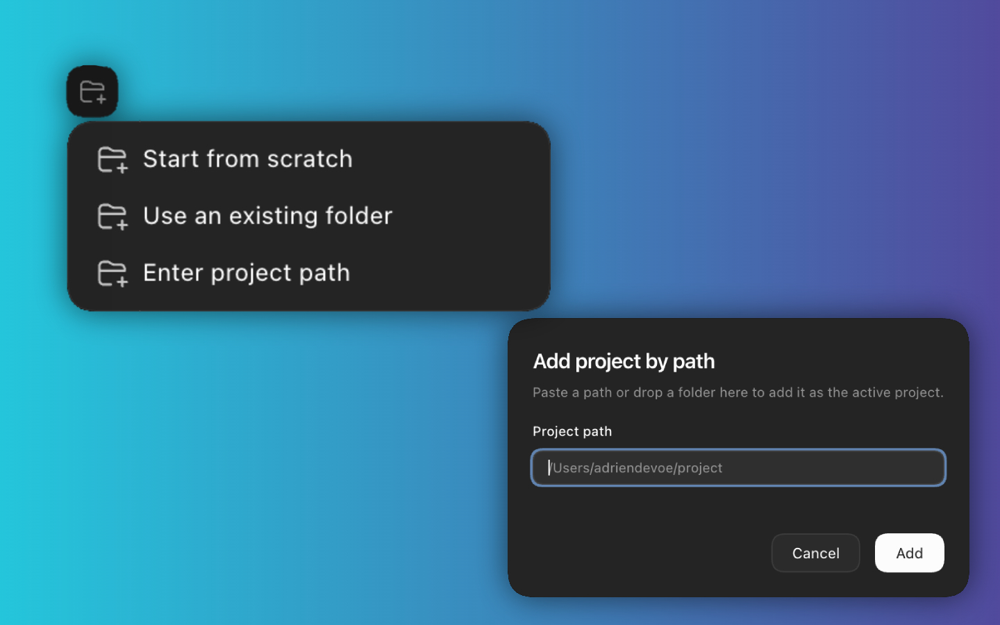

# ShadGPT Add Project by Path



ShadGPT Add Project by Path is a ShadGPT-owned fork that adds a native-looking **Enter project path** action to Codex's project menu.

It lets you add a project without opening the system folder picker. Paste a path, drop a folder, or reuse a shell command like `cd /path && ...`, and Codex adds that folder as the active project.

## Features

- Add projects from a typed local path
- Paste `file://` URLs or shell commands like `cd /path && ...`
- Drag and drop a folder onto the modal
- Expand `~` to your home directory
- Show a separate **Create folder** action when the target folder does not exist
- Show precise validation errors for permissions, files, relative paths, read-only locations, and broken paths
- Use Codex-style UI so the action feels native in the project menu

## Install

Clone this repository into your ShadGPT tweaks directory:

```sh
cd "$HOME/Library/Application Support/<ShadGPT support dir>/tweaks"
git clone https://github.com/hulibrands/codex-tweaks.git co.thomashulihan.add-project-by-path
```

Then enable **ShadGPT Add Project by Path** from ShadGPT Tweaks.

## Configure

Open Codex's project menu and choose **Enter project path**. Paste a folder path or drop a folder into the modal, then confirm to add it as the active Codex project.

The tweak accepts absolute paths, `~/` paths, `file://` URLs, and common copied terminal commands. Relative paths are rejected so Codex does not add the wrong folder by accident.

If the target folder does not exist, **Add** only reports the missing path. Use **Create folder** to explicitly create it and add it as the active project.
